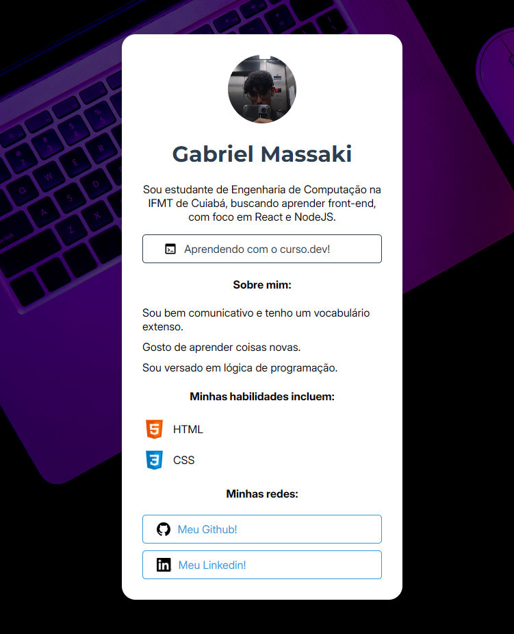

# Cartão de Visita - Gabriel Massaki

Bem-vindo ao meu primeiro projeto de portfólio! 👋

Este projeto foi desenvolvido como parte dos meus estudos em desenvolvimento Front-end, com o objetivo de colocar em prática conceitos fundamentais de HTML5 e CSS3.

## 📸 Preview

<div align="center">
  
</div>

Acesse o projeto rodando aqui: **https://massaki-msfk.github.io/cartao-de-visita/**

## 🚀 Tecnologias Utilizadas

O projeto foi construído utilizando tecnologias nativas da web:

* **HTML5:** Estruturação semântica do conteúdo.
* **CSS3:** Estilização completa, incluindo:
    * **Flexbox:** Para alinhamento de ícones e textos.
    * **Background Effects:** Uso de sobreposição de cores e imagens de fundo.

## 📱 Funcionalidades

* **Links Sociais:** Botões interativos para acesso rápido ao GitHub e LinkedIn.
* **Apresentação Pessoal:** Seção "Sobre mim" e listagem de habilidades atuais.

## 🔧 Como rodar o projeto localmente

1.  Clone este repositório:
    ```bash
    git clone https://github.com/massaki-msfk/cartao-de-visita.git
    ```
2.  Abra o arquivo `index.html` no seu navegador de preferência.

## 📬 Contato

E-mail: *msfkmsfkmsfk@gmail.com*
LinkedIn: *https://www.linkedin.com/in/gabriel-massaki-fukushima-849029247*

---
## 📋 Tarefas futuras
* ~~Logos nos botões dos links~~ (Finalizado!) ✅
* Responsividade para o celular

Developed with 💜 by Gabriel Massaki
